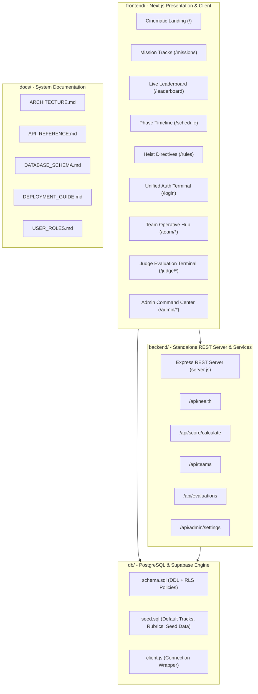

# VICEVERSE Platform Architecture

VICEVERSE is an enterprise-grade, cyber-heist styled event management and live judging platform engineered for high-stakes hackathons, ideathons, and technical design symposia.



---

## 1. Top-Level Directory Layout

```
idea judge/
├── frontend/                         # Presentation Layer (Next.js 14 App Router)
│   ├── public/                       # Static PWA manifest and icons
│   ├── src/
│   │   ├── app/                      # Next.js App Router (Pages & Route Handlers)
│   │   │   ├── (public)/             # Landing, Missions, Schedule, Leaderboard, Rules, Login
│   │   │   ├── team/                 # Mobile-First Operative Experience
│   │   │   ├── judge/                # Judge Evaluation Cockpit & Archive
│   │   │   ├── admin/                # Command Center Telemetry & Controls
│   │   │   └── api/                  # Built-in Route Handlers
│   │   ├── components/               # Layouts, Sidebars, Toast, Modals, Brackets
│   │   ├── lib/                      # DataStore, Scoring Engine, Mock Data, Utilities
│   │   └── styles/                   # Cyberpunk HUD Design System & Tokens
│   ├── package.json
│   └── next.config.mjs
│
├── backend/                          # Backend Server & Microservices
│   ├── server.js                     # Express REST API Server
│   └── package.json                  # Backend dependencies
│
├── db/                               # Database Schemas & Migrations
│   ├── schema.sql                    # Full PostgreSQL Schema & RLS Policies
│   ├── seed.sql                      # Tracks, Rubrics, Admin, Judge, and Team Seed
│   └── client.js                     # Supabase DB Client connector
│
├── docs/                             # Technical Documentation Suite
│   ├── ARCHITECTURE.md               # System design & architecture blueprint
│   ├── API_REFERENCE.md              # REST API endpoint specifications
│   ├── DATABASE_SCHEMA.md            # PostgreSQL schema & RLS policies
│   ├── DEPLOYMENT_GUIDE.md           # Production deployment instructions
│   └── USER_ROLES.md                 # RBAC Clearance & workflow guide
│
├── .gitignore                        # Universal Git ignore rules
├── .env.example                      # Environment variables template
└── package.json                      # Monorepo scripts root
```

---

## 2. Security & RBAC Clearance Model

The platform enforces strict role-based access control across 3 clearance tiers:

| Clearance Level | Role Identifier | Authorized Routes | Capabilities |
| :--- | :--- | :--- | :--- |
| **Tier 1 (Operative)** | `team` | `/team/*`, `/missions`, `/leaderboard`, `/rules` | Submit blueprints, view live scores & rubric breakdown, inspect squad dossier |
| **Tier 2 (Syndicate)** | `judge` | `/judge/*`, `/missions`, `/leaderboard` | Inspect assigned submissions, grade criteria via dynamic sliders, save drafts, lock marks |
| **Tier 3 (Root Command)** | `admin` | `/admin/*`, All routes | Full CRUD over teams/judges, calibrate rubrics, broadcast alerts, toggle score visibility |
