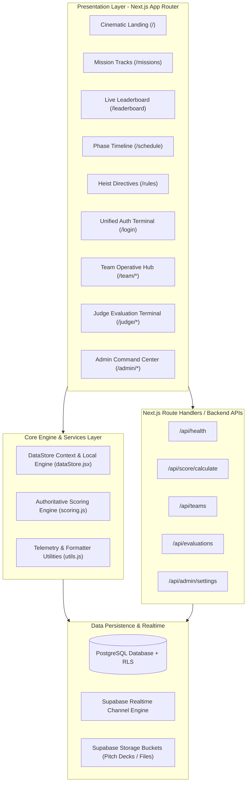

# VICEVERSE Platform Architecture

VICEVERSE is an enterprise-grade, cyber-heist styled event management and live judging platform engineered for high-stakes hackathons, ideathons, and technical design symposia.



---

## 1. Modular Directory Structure

```
idea judge/
├── docs/                             # Full Platform Technical Documentation
│   ├── ARCHITECTURE.md               # System design & architecture blueprint
│   ├── API_REFERENCE.md              # REST API endpoint specifications
│   ├── DATABASE_SCHEMA.md            # PostgreSQL schema & RLS policies
│   ├── DEPLOYMENT_GUIDE.md           # Production deployment instructions
│   └── USER_ROLES.md                 # RBAC Clearance & workflow guide
│
├── public/                           # Static Assets & PWA Manifest
│   └── manifest.json
│
├── src/
│   ├── app/                          # Next.js App Router (Frontend Pages & Backend APIs)
│   │   ├── (public)/                 # Landing, Missions, Schedule, Leaderboard, Rules, Login
│   │   ├── team/                     # Mobile-First Operative Experience
│   │   ├── judge/                    # Judge Evaluation Cockpit & Archive
│   │   ├── admin/                    # Command Center Telemetry & Controls
│   │   └── api/                      # Backend API Route Handlers
│   │
│   ├── components/                   # Reusable UI & Layout Component Library
│   │   ├── layout/                   # Navbars, Footers, Headers, Sidebars, BottomDock
│   │   └── ui/                       # Toast, Countdown, Modals, Cards, ClearanceGuard
│   │
│   ├── lib/                          # Business Logic & Infrastructure Connectors
│   │   ├── dataStore.jsx             # Universal Data Provider & Realtime Engine
│   │   ├── scoring.js                # Authoritative Multi-Judge Scoring Algorithm
│   │   ├── mockData.js               # Default Seed & Standalone Demo State
│   │   ├── utils.js                  # Formatting, Clsx, and Date helpers
│   │   └── supabase/                 # Supabase Client & Connection Checks
│   │
│   └── styles/                       # Cyberpunk HUD Design System
│       └── globals.css               # Visual Tokens, Animations, & Responsive Grid
│
├── supabase/                         # Database Migration Scripts
│   ├── schema.sql                    # Full PostgreSQL Schema & RLS Policies
│   └── seed.sql                      # Tracks, Rubrics, Admin, Judge, and Team Seed
│
├── .env.example                      # Environment template
├── .gitignore                        # Exhaustive Git ignore definitions
├── next.config.mjs
└── package.json
```

---

## 2. Security & RBAC Clearance Model

The platform enforces strict role-based access control across 3 clearance tiers:

| Clearance Level | Role Identifier | Authorized Routes | Capabilities |
| :--- | :--- | :--- | :--- |
| **Tier 1 (Operative)** | `team` | `/team/*`, `/missions`, `/leaderboard`, `/rules` | Submit blueprints, view live scores & rubric breakdown, inspect squad dossier |
| **Tier 2 (Syndicate)** | `judge` | `/judge/*`, `/missions`, `/leaderboard` | Inspect assigned submissions, grade criteria via dynamic sliders, save drafts, lock marks |
| **Tier 3 (Root Command)** | `admin` | `/admin/*`, All routes | Full CRUD over teams/judges, calibrate rubrics, broadcast alerts, toggle score visibility |

---

## 3. Authoritative Scoring & Aggregation Flow

1. **Criterion Level**: Each criterion in the active rubric is assigned a score bounded by $[0, \text{max\_marks}]$ with optional qualitative notes.
2. **Evaluation Level**: Computed either as an arithmetic sum, simple average, or weighted average according to the active rubric formula.
3. **Team Aggregate Level**: All completed evaluations from assigned judges are aggregated. Outlier detection warns administrators if judge scores diverge significantly ($> 12\text{ pts}$).
4. **Leaderboard**: Automatically ranks active squads with tie-breaking rules based on prototype execution.
